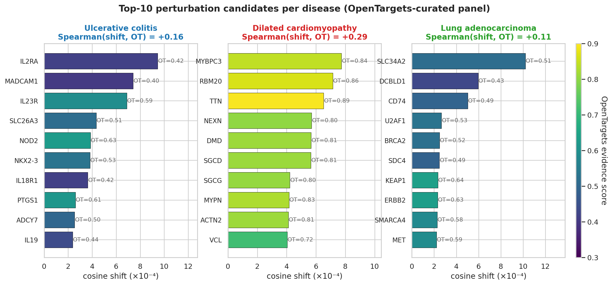

# CellProbe — drug-target identification across three indications, on NVIDIA BioNeMo

> **NVIDIA BioNeMo 2.7.1** · **Geneformer 10M** · **NVIDIA L4 (AWS `g6.xlarge`, `eu-west-3`)** · **CELLxGENE Census** · **OpenTargets**



For three drug-discovery indications — **ulcerative colitis**, **dilated cardiomyopathy**, **lung adenocarcinoma** — CellProbe applies a frozen **Geneformer 10M** foundation model from **NVIDIA BioNeMo** to:

- classify disease vs. healthy single cells (test AUC 0.97 – 1.00 across the three indications), and
- rank candidate therapeutic targets via in-silico gene knockout, validated against the OpenTargets disease–target catalogue.

End-to-end pipeline on a single AWS EC2 instance with one NVIDIA L4 GPU, EMEA-resident in `eu-west-3` (Paris). Total compute: **~$20**. Single shell command per stage to reproduce.

## Headline numbers

| Indication | Cells (train/val/test) | Test AUC | Top-3 perturbation candidates |
|---|---|---|---|
| Ulcerative colitis | 54 k / 12 k / 12 k | **0.996** | IL2RA · MADCAM1 · IL23R |
| Dilated cardiomyopathy | 140 k / 30 k / 30 k | **0.965** | MYBPC3 · RBM20 · TTN |
| Lung adenocarcinoma | 140 k / 30 k / 30 k | **0.998** | SLC34A2 · DCBLD1 · CD74 |

Every top-3 list contains genes that are either (a) targets of clinically used or late-stage IBD/oncology drugs (IL2RA → daclizumab, MADCAM1 → etrolizumab, ERBB2 → trastuzumab class) or (b) the most frequent causal mutations of the indication (TTN, MYBPC3, RBM20 for DCM).

Full results, methodology, and per-gene tables: [`RESULTS.md`](RESULTS.md).

## What this project actually does

Three stages, one Python module each:

1. **Data preparation** (`src/data/`) — download three scRNA-seq disease cohorts from CELLxGENE Census, apply standard QC, stratified split, and convert to BioNeMo's SCDL tokenised format.
2. **Frozen-encoder probe** (`src/eval/`) — run inference with pretrained Geneformer 10M to obtain per-cell embeddings (256 dim), then train a scikit-learn MLP classifier on top. Mirrors the methodology of `bionemo.geneformer.scripts.celltype_classification_bench`.
3. **In silico perturbation** (`src/perturb/`) — for a panel of disease-associated candidate genes (drawn from OpenTargets), zero the gene's column in the AnnData subset, re-run BioNeMo's `convert_h5ad_to_scdl` + `infer_geneformer`, and measure the cosine shift in cell embeddings. Validate the resulting ranking against OpenTargets' curated disease–target associations.

All three stages are containerised in NVIDIA's official `bionemo-framework:2.7.1` Docker image and orchestrated by the bash wrappers under `scripts/`.

## Reproducing the results

The full procedure is documented in **[`docs/SETUP_AWS.md`](docs/SETUP_AWS.md)** — quota check, instance launch, BioNeMo container pull, smoke test, and the three pipeline scripts. A condensed view:

```bash
# On the AWS EC2 instance, after the BioNeMo container is loaded and code synced
./scripts/run_data_pipeline.sh                  # stage 1
./scripts/run_probe_pipeline.sh                 # stage 2
# Per-disease perturbation (stage 3); EFO IDs in src/perturb/validate.py
docker run --rm --gpus all ... bionemo-framework:2.7.1 \
  python -m src.perturb.perturb --disease uc \
    --n-cells 200 --max-genes 50 --opentargets-efo EFO_0000729

# Generate the figures locally (no GPU needed)
python scripts/make_figures.py
```

Compute envelope: **~$20** total on AWS EC2 `g6.xlarge` in `eu-west-3` (1 × NVIDIA L4 24 GB).

## Repository layout

```
configs/diseases.yaml          # per-indication dataset id, EFO, QC overrides
src/data/                      # download + QC + split + SCDL conversion
src/eval/                      # embedding extraction + MLP probe + metrics
src/perturb/                   # perturbation + OpenTargets validation
scripts/                       # orchestration shell wrappers + figures
docs/SETUP_AWS.md              # full AWS / BioNeMo bring-up procedure
docs/SETUP.md                  # alternative local-GPU bring-up (WSL2 + RTX 4070 SUPER)
docs/PROJECT_HISTORY.md        # design decisions, alternatives, internal notes
results/<disease>/probe_metrics.json
results/<disease>/perturbation/perturbation.json
results/<disease>/validation.json
results/figures/               # the 3 figures shown in RESULTS.md
RESULTS.md                     # headline numbers and per-disease tables
```

## Stack

- **NVIDIA BioNeMo Framework 2.7.1** (`nvcr.io/nvidia/clara/bionemo-framework:2.7.1`) — Geneformer 10M checkpoint, `convert_h5ad_to_scdl`, `infer_geneformer`
- **CELLxGENE Census** — single-cell data source (Reichart 2022, Oliver 2024, Salcher 2022)
- **OpenTargets Platform v25** — curated disease-target associations for validation (GraphQL API)
- **AWS EC2 `g6.xlarge`** — single NVIDIA L4 GPU in `eu-west-3`
- **scanpy / anndata** — h5ad I/O and QC
- **scikit-learn** — MLP probe + cross-validation
- **matplotlib / seaborn** — figures

## Design notes

The full design rationale, alternatives considered, and engineering trade-offs (methodology pivot from end-to-end fine-tuning to NVIDIA's official frozen-probe benchmark; cloud cost discipline; OpenTargets candidate-selection choice) are documented in [`docs/PROJECT_HISTORY.md`](docs/PROJECT_HISTORY.md).

## References

- Theodoris C. V. *et al.* (2023). [Transfer learning enables predictions in network biology](https://www.nature.com/articles/s41586-023-06139-9). *Nature* 618, 616–624.
- Reichart D. *et al.* (2022). [Pathogenic variants damage cell composition and single-cell transcription in cardiomyopathies](https://www.science.org/doi/10.1126/science.abo1984). *Science* 377.
- Oliver A. J. *et al.* (2024). [Single-cell integration reveals metaplasia in inflammatory gut diseases](https://www.nature.com/articles/s41586-024-07571-1). *Nature* 631.
- Salcher S. *et al.* (2022). [High-resolution single-cell atlas reveals diversity and plasticity of tissue-resident neutrophils in non-small cell lung cancer](https://www.cell.com/cancer-cell/fulltext/S1535-6108(22)00499-3). *Cancer Cell* 40.
- NVIDIA BioNeMo Framework documentation: <https://docs.nvidia.com/bionemo-framework/2.7.1/>

## License

Code under Apache 2.0. Data subject to the licences of the original CELLxGENE depositions (see each dataset on <https://cellxgene.cziscience.com/>).
